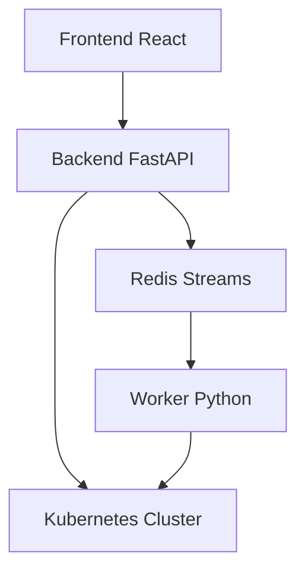
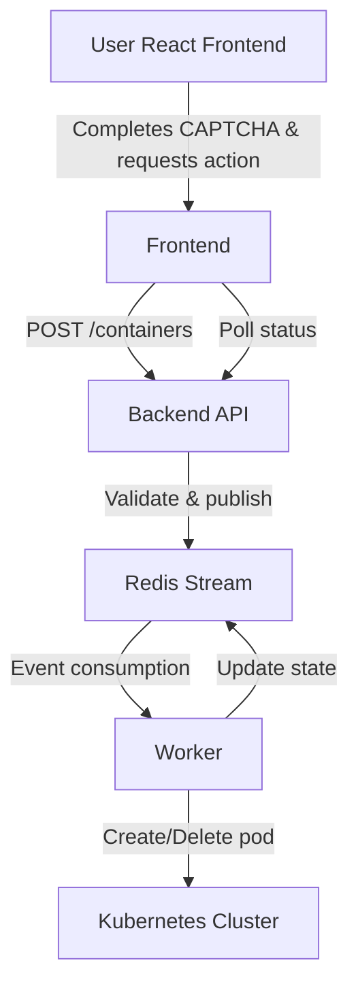

# Sprout

A container management platform with React frontend, FastAPI backend, Redis-based event streaming, and Kubernetes orchestration.

## Architecture



**Stack**: React 18 + Vite + Tailwind • FastAPI + Python 3.11 • Redis Streams • Kubernetes • Traefik + Let's Encrypt

## Components

### Frontend (React + Nginx)
- **Framework**: React 18, Vite, Tailwind CSS, Lucide Icons
- **Features**: Interactive CAPTCHA slider, real-time container status, rate limit display, responsive animations
- **Deployment**: Nginx serving static files with API proxy

### Backend (FastAPI)
- **Purpose**: REST API for container operations
- **Tech Stack**: Python 3.11, FastAPI, Pydantic
- **Endpoints**:
  ```
  POST /captcha/request     - Get CAPTCHA token
  POST /containers          - Create container
  DELETE /containers/{id}   - Delete container
  GET /containers           - List containers
  GET /rate-limit           - Check rate limit
  ```

### Redis
- **Purpose**: Event streaming and state management
- **Usage**: Container state storage (TTL 24h), rate limiting, CAPTCHA validation, event streaming via `container_events`

### Worker (Kubernetes Client)
- **Purpose**: Pod management in Kubernetes
- **Functions**: Consumes Redis events, creates/deletes pods, updates states, error handling
- **Scaling**: KEDA monitors Redis stream lag (0-10 replicas)

## Data Flow



## Container Lifecycle

**States**:
- `pending`: Created in Redis, awaiting pod deployment
- `running`: Deployed successfully
- `failed`: Deployment failed (error details stored)
- `deleted`: Removed successfully

**Networking**: Traefik Ingress, SSL via cert-manager, ClusterIP services, namespace `sprout`

## Quick Start

### Development (Hot-reload)
```bash
chmod +x develop.sh && ./develop.sh
```

### Local K3s Deployment
```bash
chmod +x deploy.sh && ./deploy.sh
```

## Security Features

### Authentication & Authorization
- **API Key**: All requests require `X-API-Key` header
- **CAPTCHA**: Interactive slider-based verification with 5-minute token expiry

### Rate Limiting
- **Client Limits**: 100 requests per 15 minutes per IP
- **Container Limits**: Maximum 3 containers per deployment
- **Storage**: Redis-based distributed rate limiting

### Network Security
- **CORS**: Explicit origin allowlist
- **SSL/TLS**: Let's Encrypt certificates via cert-manager
- **Container Isolation**: Kubernetes namespace isolation with resource limits (128Mi memory, 200m CPU)

### Monitoring
- Request logging with timestamps
- Failed authentication tracking
- Container lifecycle event logging to Redis streams

## Production Deployment

### Prerequisites
- Kubernetes cluster with Traefik ingress
- Helm 3.x
- Azure Pipelines with self-hosted agent
- K3s kubeconfig (`k3s.yml` in Azure DevOps secure files)

### Required Variables (k3s-deployment-vars group)
```
GHCR_USERNAME, GHCR_TOKEN
REGISTRY, REGISTRY_USER
DOMAIN, RELEASE_NAME, NAMESPACE
LETSENCRYPT_EMAIL
REDIS_PASSWORD
Grafana_USERNAME, Grafana_PASSWORD
```

### Pipeline Steps
1. **Build**: Checkout + Git LFS → Generate BUILD_TAG → Build/push Docker images
2. **Deploy**: Download kubeconfig → Create Redis secret → Helm deployment → Verification

### Build Tag Format
```bash
BUILD_TAG="$(Build.BuildId)-$(date +%Y%m%d%H%M%S)"
```

### Deployment Commands
```bash
# Create Redis secret
kubectl create secret generic redis-secret \
  --namespace $(NAMESPACE) \
  --from-literal=redis-password="$(REDIS_PASSWORD)"

# Helm deployment
helm upgrade --install $(RELEASE_NAME) ./helm-chart \
  --namespace $(NAMESPACE) --create-namespace \
  --force --wait
```

### Verification
```bash
kubectl get all -n $(NAMESPACE)
kubectl get ingress -n $(NAMESPACE)
kubectl describe ingress -n $(NAMESPACE)
```

**Access Points**:
- Frontend: `https://$(DOMAIN)`
- Backend API: `https://$(DOMAIN)/api`

## Requirements

**Development**: Docker, K3s, Helm, Visual Studio, VS Dev Containers, kubectl

**Production**: Kubernetes, Traefik, Azure Pipelines, GHCR access, Redis

## Network Architecture

- **Frontend**: Nginx proxy to backend API
- **Ingress**: Traefik with Let's Encrypt SSL
- **Services**: ClusterIP in `sprout` namespace
- **Scaling**: KEDA autoscaling based on Redis stream lag

---

**Tech Stack**: React • FastAPI • Redis • Kubernetes • Docker • Helm • Traefik
