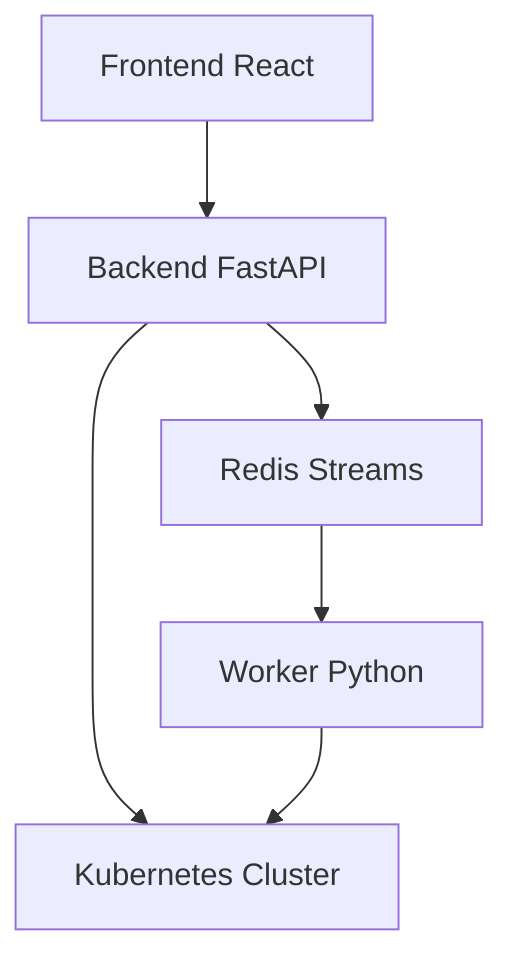
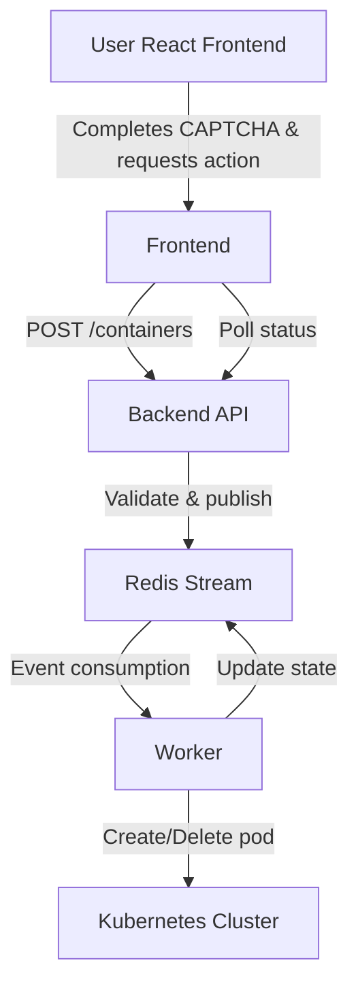

# Sprout System Architecture Guide

## Overview
Sprout is a container management platform with a React frontend, FastAPI backend, Redis-based event streaming, and Kubernetes orchestration.




## Frontend (React + Nginx)
- **Purpose**: User interface for container management  
- **Tech Stack**: React 18, Vite, Tailwind CSS, Lucide Icons  
- **Features**:
  - Interactive CAPTCHA slider
  - Real-time container status
  - Rate limit display
  - Responsive design with animations  
- **Deployment**: Nginx serving static files with API proxy  

## Backend (FastAPI)
- **Purpose**: REST API for container operations  
- **Tech Stack**: Python 3.11, FastAPI, Pydantic  
- **Endpoints**:
```

POST /captcha/request     - Get CAPTCHA token
POST /containers          - Create container
DELETE /containers/{id}   - Delete container
GET /containers           - List containers
GET /rate-limit           - Check rate limit

````
  

## Redis
- **Purpose**: Event streaming and state management  
- **Usage**:
    - Container state storage (TTL 24h)
    - Rate limiting counters
    - CAPTCHA token validation
    - Event streaming via `container_events` stream  

## Worker (Kubernetes Client)
- **Purpose**: Pod management in Kubernetes  
- **Tech Stack**: Python 3.11, kubernetes-client  
- **Functions**:
    - Consumes Redis events
    - Creates/deletes Kubernetes pods
    - Updates container states in Redis
    - Error handling and retries  
- **Scaling**: KEDA monitors Redis stream lag and scales worker pods (0–10 replicas)

## Data Flow


## Container Lifecycle

* **States**:

  * `pending`: Created in Redis, awaiting pod deployment
  * `running`: Deployed successfully
  * `failed`: Deployment failed (error details stored)
  * `deleted`: Removed successfully


* **Networking**: Traefik Ingress, SSL via cert-manager, ClusterIP services, namespace `sprout`


